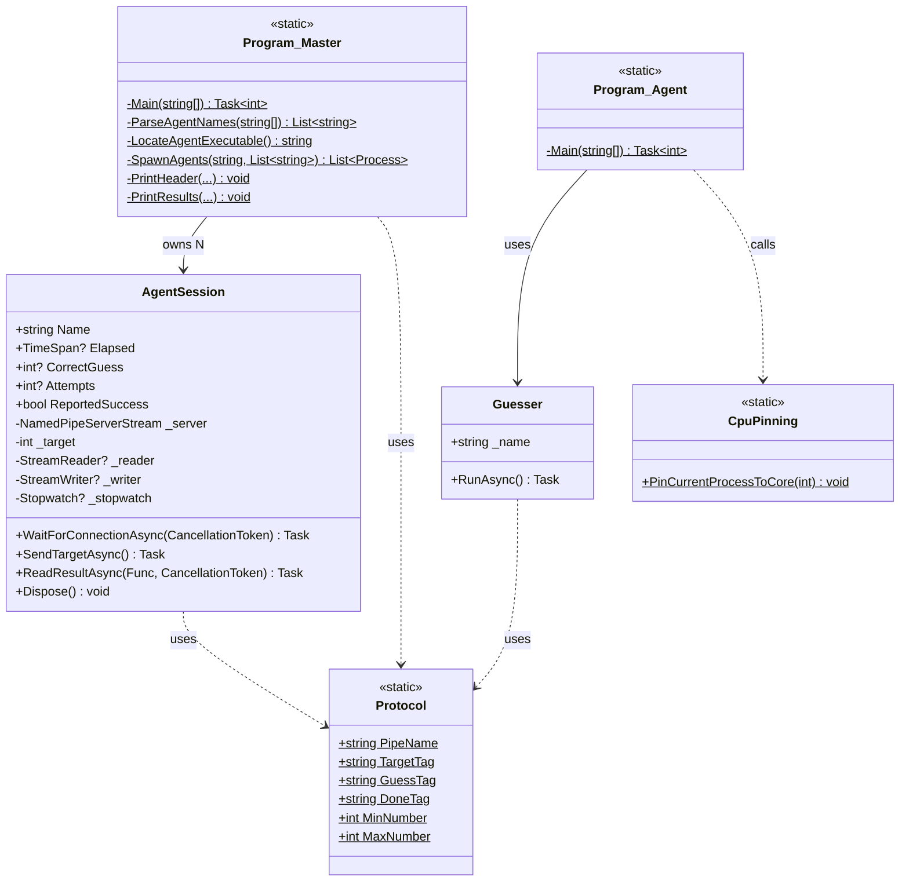

# Class diagram

```mermaid
classDiagram
    class Protocol {
        <<static>>
        +string PipeName$
        +string TargetTag$
        +string GuessTag$
        +string DoneTag$
        +int MinNumber$
        +int MaxNumber$
    }

    class CpuPinning {
        <<static>>
        +PinCurrentProcessToCore(int) void$
    }

    class Program_Master {
        <<static>>
        -Main(string[]) Task~int~$
        -ParseAgentNames(string[]) List~string~$
        -LocateAgentExecutable() string$
        -SpawnAgents(string, List~string~) List~Process~$
        -PrintHeader(...) void$
        -PrintResults(...) void$
    }

    class AgentSession {
        +string Name
        +TimeSpan? Elapsed
        +int? CorrectGuess
        +int? Attempts
        +bool ReportedSuccess
        -NamedPipeServerStream _server
        -int _target
        -StreamReader? _reader
        -StreamWriter? _writer
        -Stopwatch? _stopwatch
        +WaitForConnectionAsync(CancellationToken) Task
        +SendTargetAsync() Task
        +ReadResultAsync(Func, CancellationToken) Task
        +Dispose() void
    }

    class Program_Agent {
        <<static>>
        -Main(string[]) Task~int~$
    }

    class Guesser {
        +string _name
        +RunAsync() Task
    }

    Program_Master --> AgentSession : owns N
    AgentSession ..> Protocol : uses
    Program_Master ..> Protocol : uses
    Program_Agent --> Guesser : uses
    Program_Agent ..> CpuPinning : calls
    Guesser ..> Protocol : uses
```
