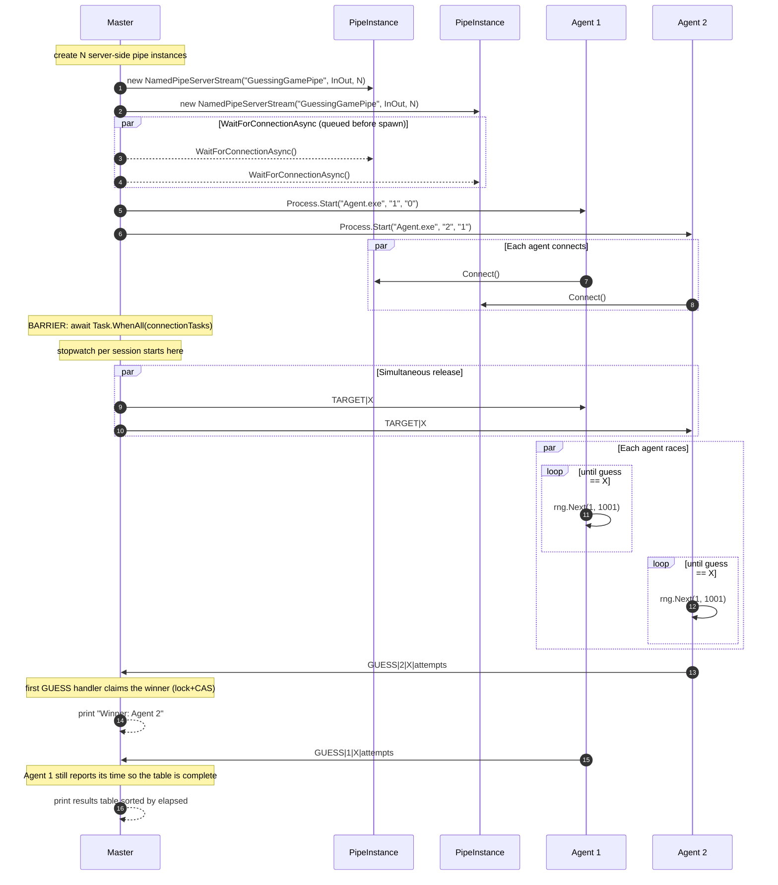

# Sequence diagram — fair-race protocol

GitHub renders Mermaid blocks inline, so this file shows as a real diagram on the repo page.

```mermaid
sequenceDiagram
    autonumber
    participant M as Master
    participant P1 as PipeInstance #1
    participant P2 as PipeInstance #2
    participant A1 as Agent 1
    participant A2 as Agent 2

    Note over M: create N server-side pipe instances
    M->>P1: new NamedPipeServerStream("GuessingGamePipe", InOut, N)
    M->>P2: new NamedPipeServerStream("GuessingGamePipe", InOut, N)

    par WaitForConnectionAsync (queued before spawn)
        M-->>P1: WaitForConnectionAsync()
        M-->>P2: WaitForConnectionAsync()
    end

    M->>A1: Process.Start("Agent.exe", "1", "0")
    M->>A2: Process.Start("Agent.exe", "2", "1")

    par Each agent connects
        A1->>P1: Connect()
        A2->>P2: Connect()
    end

    Note over M: BARRIER: await Task.WhenAll(connectionTasks)
    Note over M: stopwatch per session starts here

    par Simultaneous release
        M->>A1: TARGET|X
        M->>A2: TARGET|X
    end

    par Each agent races
        loop until guess == X
            A1->>A1: rng.Next(1, 1001)
        end
        loop until guess == X
            A2->>A2: rng.Next(1, 1001)
        end
    end

    A2->>M: GUESS|2|X|attempts
    Note over M: first GUESS handler claims the winner (lock+CAS)
    M-->>M: print "Winner: Agent 2"
    A1->>M: GUESS|1|X|attempts
    Note over M: Agent 1 still reports its time so the table is complete

    M-->>M: print results table sorted by elapsed
```
